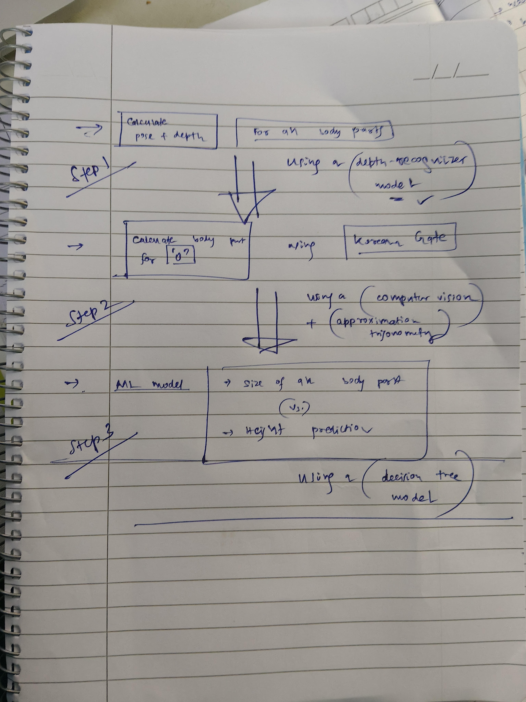

# Height_Find_Pipeline
A simple repo that can help find height of an individual using AI and computer vision

# Tags:
- Artificial Intelligence. (for SEO)
- Computer Vision.
- Deep Learning.

# Pipeline.

- See the rough pipeline here:
</img>

# Colab Files:
- [Notebook 1](https://colab.research.google.com/drive/1l5jeDQ8k2RgfJWENFBIBnECZ89dyX78w?usp=sharing) : Explains how computer vision and AI is used to get pose estimated pictures and depth maps.
- [Notebook 2](https://colab.research.google.com/drive/1l5jeDQ8k2RgfJWENFBIBnECZ89dyX78w?usp=sharing) : Explains the process of getting actual length using relative depth and computer vision
- _[Notebook 3]_ (Coming soon) - Some EDA around population, how much can one tell by shoulder height etc.
- _[Notebook 4]_ (Coming not so soon) - A pure AI approach to the problem.

# Results:

| Measurement       | Value  |
|-------------------|--------|
| Shoulder Width    | 40.1 cm|
| Chest Width       | 30 cm  |
| Pelvic Width      | 30.7 cm|
| Head to Waist     | 82 cm  |
| Arm Length        | 41 cm  |
| Waist to Knee     | 55 cm  |
| Knee to Ankle     | 59 cm  |
| Total Height      | 195 cm |
